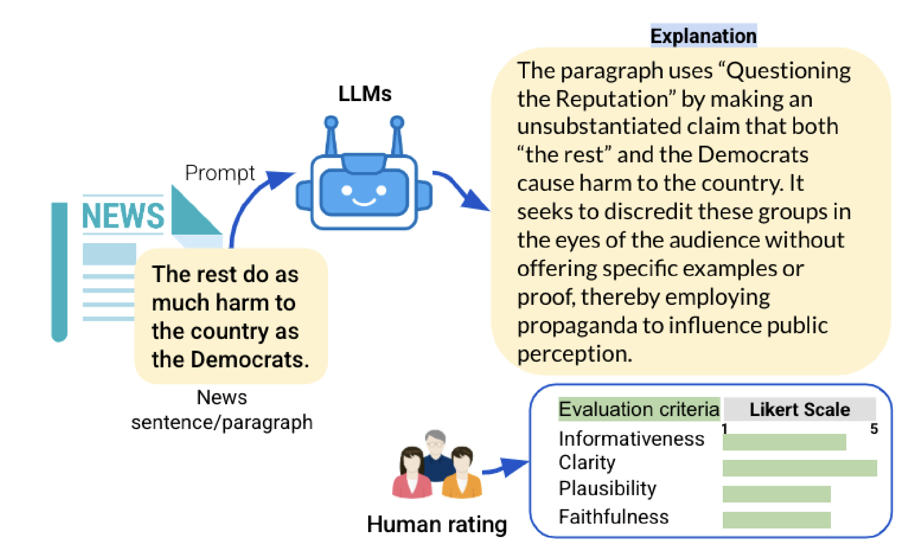

# PropXplain: Explainable Propaganda Detection

[](LICENSE)
[](https://python.org)
[](https://aclanthology.org/2025.findings-emnlp.1296/)
[](https://huggingface.co/datasets/QCRI/PropXplain)

**PropXplain** detects propaganda in text and generates natural language explanations using Llama-3.1-8B-Instruct. Supports Arabic and English with ~27K annotated samples.



*Paper: [PropXplain: Can LLMs Enable Explainable Propaganda Detection?](https://aclanthology.org/2025.findings-emnlp.1296/) (EMNLP 2025)*

## 🚀 Quick Start

```bash
# Setup environment
git clone https://github.com/firojalam/PropXplain.git
cd PropXplain
conda create -n propxplain python=3.10 -y
conda activate propxplain
pip install -r bin/text-classification/requirements.txt

# Run inference (Arabic example)
bash scripts/inference/run_inference_ar.sh

# Evaluate results
bash scripts/evaluation/run_evaluation_ar.sh
```

## 📊 Datasets

Available on [🤗 HuggingFace: QCRI/PropXplain](https://huggingface.co/datasets/QCRI/PropXplain)

| Language | Total | Train | Dev | Test | Sources |
|----------|-------|-------|-----|------|---------|
| **Arabic** | 21,096 | 18,452 | 1,318 | 1,326 | 300+ news agencies, Twitter |
| **English** | 6,015 | 4,472 | 621 | 922 | 42 news sources |

**Each sample includes:**
- Text content
- Binary label (`propagandistic` / `not-propagandistic`)
- Human-validated explanation
- Quality scores (faithfulness, clarity, plausibility, informativeness)

### Loading Datasets

```python
from datasets import load_dataset

# Load data
dataset_ar = load_dataset("QCRI/PropXplain", "arabic")
dataset_en = load_dataset("QCRI/PropXplain", "english")

# Access examples
for example in dataset_ar["train"]:
    print(f"Text: {example['input']}")
    print(f"Label: {example['label']}")
    print(f"Explanation: {example['explanation']}")
```

## 🔧 Usage

### 1. Training

Fine-tune Llama-3.1-8B using LoRA:

```bash
bash scripts/training/run_train_ar.sh  # Arabic model
```

**Training config:** LoRA rank=8, alpha=32, lr=1e-4, 24 epochs, bf16 precision

### 2. Inference

Run predictions on new data:

```bash
bash scripts/inference/run_inference_ar.sh
```

### 3. Evaluation

Compute metrics for classification and explanations:

```bash
bash scripts/evaluation/run_evaluation_ar.sh
```

### 4. Generate Explanations (Optional)

Generate explanations using OpenAI's API:

```bash
# Setup API keys first
cp .env.example .env  # Add your API keys

# Generate explanations
python bin/augment/gpt_explainer_v2.py \
    --input_file data/dataset.jsonl \
    --output_file data/dataset_with_explanations.jsonl
```

## 📈 Results

### Classification Performance

| Dataset | Micro F1 | Macro F1 | Baseline |
|---------|----------|----------|----------|
| **Arabic** | 0.775 | 0.760 | AraBERT: 0.762 |
| **English** | 0.781 | 0.675 | BERT: 0.772 |

### Explanation Quality (Human Evaluation, 1-5 scale)

| Metric | Arabic | English |
|--------|--------|---------|
| Faithfulness | 4.35 | 4.72 |
| Clarity | 4.49 | 4.76 |
| Plausibility | 4.42 | 4.71 |
| Informativeness | 4.26 | 4.71 |

**High inter-annotator agreement:** r*wg(j) > 0.89 (Arabic), > 0.94 (English)

## 📁 Repository Structure

```
PropXplain/
├── bin/                           # Core Python modules
│   ├── augment/                  # Explanation generation (GPT-based)
│   ├── data_processing/          # Data formatting utilities
│   ├── text-classification/      # Training & inference
│   └── train/                    # Additional utilities
├── scripts/                       # Shell scripts
│   ├── data_preparation/
│   ├── training/
│   ├── inference/
│   └── evaluation/
└── assets/                        # Figures and media
```

## 📧 Contact

- **Firoj Alam**: fialam@hbku.edu.qa
- **Giovanni Da San Martino**: giovanni.dasanmartino@unipd.it
- **Issues**: [GitHub Issues](https://github.com/firojalam/PropXplain/issues)

## 📝 Citation

```bibtex
@inproceedings{hasanain-etal-2025-propxplain,
    title = "{P}rop{X}plain: Can {LLM}s Enable Explainable Propaganda Detection?",
    author = "Hasanain, Maram and Hasan, Md Arid and Kmainasi, Mohamed Bayan and 
              Sartori, Elisa and Shahroor, Ali Ezzat and Da San Martino, Giovanni and Alam, Firoj",
    booktitle = "Findings of the Association for Computational Linguistics: EMNLP 2025",
    year = "2025",
    url = "https://aclanthology.org/2025.findings-emnlp.1296/",
    pages = "23855--23863"
}
```

## 📄 License

MIT License - see [LICENSE](LICENSE) for details.
